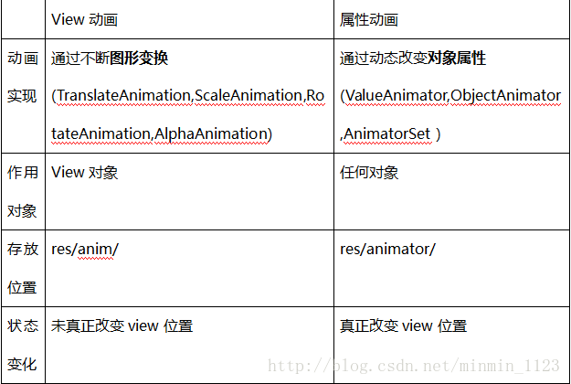

# Android 动画深入分析

Android中的动画分为三种View动画、帧动画和属性动画，其中帧动画也属于View动画的一种，只不过它和平移、旋转等常见的View动画在表现形式上略有不同而已。View动画通过对场景里的对象不断做图像变换(平移、缩放、旋转、透明度)从而产生动画效果，它是一种渐进式动画,并且View动画支持自定义。帧动画通过播放一系列图像从而产生动画效果，可以简单的理解为图片切换动画，很显然，如果图片过大会产生OOM，属性动画通过动态的改变对象的属性从而产生动画效果。

## View动画
View动画的作用对象是View，它支持四种动画效果，分别是平移动画、缩放动画、旋转动画、透明度动画。

### View动画的种类
View动画的四种变化效果对应的Animation的四个子类：TranslateAnimation、AlphaAnimation、RotateAnimation、ScaleAnimation。

|   名称       | xml标签        | 子类                |   效果
|  ----        |  ----      |----                 |   ----
| 平移动画      | translate  | TranslateAnimation  | 移动View 
| 缩放动画      | scale      |ScaleAnimation       | 放大或缩小View
| 旋转动画      | rotate     |RotateAnimation     | 旋转View
| 透明度动画    | alpha      |AlphaAnimation      | 改变View的透明度
使用View动画，要先创建动画的XML文件，文件的路径为: res/anim/filename.xml
``` xml
<?xml version="1.0" encoding="utf-8"?>
<set xmlns:android="http://schemas.android.com/apk/res/android"
    android:interpolator="@[package:]anim/interpolator_resource"
    android:shareInterpolator=["true" | "false"]
    android:fillAfter="true">
    <!--fillAfter: 动画结束后View是否停留在结束位置 -->
    
    <!-- 平移动画 对应TranslateAnimation-->
    <translate
        android:fromXDelta="float"
        android:toXDelta="float"
        android:fromYDelta="float"
        android:toYDelta="float"/>

    <!-- 
        缩放动画 对应ScaleAnimation
        pivotX:缩放的轴点的x坐标
        pivotY:缩放的轴点的y坐标
     -->
     <scale
        android:fromXScale="float"
        android:toXScale="float"
        android:fromYScale="float"
        android:toYScale="float"
        android:pivotX="float"
        android:pivotY="float"/>

    <!-- 
        旋转动画 对应于RotateAnimation 
        fromDegrees:旋转的开始角度
        toDegrees:旋转的结束角度
        pivotX:缩放的轴点的x坐标
        pivotY:缩放的轴点的y坐标
    -->
     <rotate
        android:fromDegrees="float"
        android:toDegrees="float"
        android:pivotY="float"
        android:pivotX="float"/>

    <!-- 透明度动画 对应于AlphaAnimation -->        
    <alpha 
        android:fromAlpha="float"
        android:toAlpha="float"/>

</set>

```
  &lt;set&gt;标签对应的是AnimationSet类,它可以包含多个动画并且它的内部也是可以嵌套其他动画集合的，它的两个属性的含义如下  

  android:interpolator  

表示动画集合所采用的插值器，差值器影响动画的速度，比如非匀速动画就需要通过插值器来控制动画的播放的过程。这个属性也可以不指定，默认参数为@android:anim/accelerate_decelerate_interpolator  

android:shareInterpolator  
表示集合中的动画是否和集合共享同一个插值器，如果集合不指定插值器，那么子动画就需要单独指定所需的插值器或者使用默认值。  
通过Animation的setAnimationListener方法可以设置动画的监听器。
``` java
    public static interface AnimationListener {
        /**
         * <p>Notifies the start of the animation.</p>
         *
         * @param animation The started animation.
         */
        void onAnimationStart(Animation animation);

        /**
         * <p>Notifies the end of the animation. This callback is not invoked
         * for animations with repeat count set to INFINITE.</p>
         *
         * @param animation The animation which reached its end.
         */
        void onAnimationEnd(Animation animation);

        /**
         * <p>Notifies the repetition of the animation.</p>
         *
         * @param animation The animation which was repeated.
         */
        void onAnimationRepeat(Animation animation);
    }
}

```

### 自定义View动画
自定义View动画需要继承Animation类并且重写applyTransformation()和initialize()方法。

### 帧动画
帧动画是顺序播放一组预先定义好的图片，类似于电影播放。不同于View动画，系统提供了另外一个类AnimationDrawable来使用帧动画。在res/drawable目录下新建xml文件。
``` xml
<?xml version="1.0" encoding="utf-8"?>
<animation-list xmlns:android="http://schemas.android.com/apk/res/android"
    android:oneshot="false">

    <item android:drawable="@drawable/image1" android:duration="500"/>
    <item android:drawable="@drawable/image2" android:duration="500"/>
    <item android:drawable="@drawable/image3" android:duration="500"/>

</animation-list>

```
然后将上述Drawable作为View的背景并通过Drawable来显示动画即可。
``` java
    view.setBackgroundResources(R.drawable.frame_animation);
    AnimationDrawable drawable = view.getBackground();
    drawable.start();
```
> 在使用帧动画时避免使用尺寸较大的图片容易引起OOM。

## View动画的特殊使用场景
### LayoutAnimation  
### Activity的切换效果
启动Activity时可以设置自定义的切换效果
```java
    Intent intent = new Intent(MainActivity.this, TestActivity.class);
    startActivity(intent);
    overridePendingTransition(R.anim.enter_anim, R.anim.exit_anim);

```
当Activity退出时也可以指定切换效果
```java
    @Override
    public void finish() {
        super.finish();
        overridePendingTransition(R.anim.enter_anim, R.anim.exit_anim);//用于activity间的切换动画
    }
```
## 属性动画

### 使用属性动画
&emsp;&emsp;属性动画可以对任意对象的属性进行动画而不仅仅是View,动画的默认时间间隔为300ms，默认帧率为10ms/帧。属性动画可以完成在一个时间间隔内完成对象的一个属性值到另一个属性值的改变。  
&emsp;&emsp; 属性动画和View动画的区别如下。 



**属性动画使用方法**  
1. 使用ValueAnimator
```java
Button mButton = (Button) findViewById(R.id.Button);
        // 创建动画作用对象：此处以Button为例

// 步骤1：设置属性数值的初始值 & 结束值
        ValueAnimator valueAnimator = ValueAnimator.ofInt(mButton.getLayoutParams().width, 500);
        // 初始值 = 当前按钮的宽度，此处在xml文件中设置为150
        // 结束值 = 500
        // ValueAnimator.ofInt()内置了整型估值器,直接采用默认的.不需要设置
        // 即默认设置了如何从初始值150 过渡到 结束值500

// 步骤2：设置动画的播放各种属性
        valueAnimator.setDuration(2000);
        // 设置动画运行时长:1s

// 步骤3：将属性数值手动赋值给对象的属性:此处是将 值 赋给 按钮的宽度
        // 设置更新监听器：即数值每次变化更新都会调用该方法
        valueAnimator.addUpdateListener(new AnimatorUpdateListener() {
            @Override
            public void onAnimationUpdate(ValueAnimator animator) {

                int currentValue = (Integer) animator.getAnimatedValue();
                // 获得每次变化后的属性值
                System.out.println(currentValue);
                // 输出每次变化后的属性值进行查看

                mButton.getLayoutParams().width = currentValue;
                // 每次值变化时，将值手动赋值给对象的属性
                // 即将每次变化后的值 赋 给按钮的宽度，这样就实现了按钮宽度属性的动态变化
// 步骤4：刷新视图，即重新绘制，从而实现动画效果
                mButton.requestLayout();
                
            }
        });

        valueAnimator.start();
        // 启动动画

    }
```
2. 使用ObjectAnimator
```java
    public static ObjectAnimator ofFloat(Object target, String propertyName, float... values) {
        ObjectAnimator anim = new ObjectAnimator(target, propertyName);
        anim.setFloatValues(values);
        return anim;
    }
```
### 理解插值器和估值器
TimeInterpolator翻译为时间差值器，它的作用是根据时间流逝的百分比来计算出当前属性值改变的百分比。  
系统预置时间差值器
- LinearInterpolator(线性差值器: 匀速动画)
- AccelerateDecelerateInterpolator(加速减速差值器：动画两头慢中间快)
- DecelerateInterpolator(减速差值器：动画越来越慢)
- BounceInterpolator(弹性差值器：高空下落重力影响效果)

TypeEvaluator的翻译为类型估值法，也叫估值器。它的作用是根据当前属性改变的百分比计算出改变后的属性值。
### 属性动画的监听器
&emsp;&emsp;属性动画提供了监听器用于监听动画的播放过程，主要提供了两个接口。AnimationListener和AnimatorUpdateListener。  
AnimationListener的定义如下。
```java

    public static interface AnimationListener {
        /**
         * <p>Notifies the start of the animation.</p>
         */
        void onAnimationStart(Animation animation);

        /**
         * <p>Notifies the end of the animation. This callback is not invoked
         * for animations with repeat count set to INFINITE.</p>
         */
        void onAnimationEnd(Animation animation);

        /**
         * <p>Notifies the repetition of the animation.</p>
         */
        void onAnimationRepeat(Animation animation);
    }
```
AnimatorUpdateListener的定义如下，它会监听整个动画过程，每播放一帧，onAnimationUpdate()就会被调用一次。
```java

    public static interface AnimatorUpdateListener {
        /**
         * <p>Notifies the occurrence of another frame of the animation.</p>
         */
        void onAnimationUpdate(ValueAnimator animation);

    }
```
### 对任意属性做动画
&emsp;&emsp;View动画只支持四种类型:平移、旋转、缩放、透明度。能够实现的效果有限。  

**属性动画的工作原理**  
&emsp;&emsp;属性动画要求动画作用的对象提供该属性的get和set方法，属性动画根据外界传递的该属性的初始值和最终值，以动画的效果多次去调用set方法，每次传递给set的值都不一样，确切的说是随着时间的推移，所传递的值越来越接近最终值。  
&emsp;&emsp;如果要对object的属性abc做动画，如果想要让动画生效，需要满足两个条件:  
1. object必须提供setAbc方法，如果设置动画的 时候没有传递初始值，那么还要提供getAbc方法，因为系统要去取abc属性的初始值(如果不满足会崩溃)
2. object的setAbc对属性所做的改变必须通过某种方法反映出来，比如会对UI带来改变(如果不满足，则动画无效果)

因此如果操作View的某个属性不生效，则需要考虑以下方法:  
- 给对象加上get和set方法(仅自定义View)
- 用一个包装类来包装原始对象，间接提供set和get方法
- 采用ValueAnimator，监听动画过程，自己实现属性的改变

```java


```
### 属性动画的工作原理


## 使用动画的注意事项
- OOM问题 主要出现在帧动画上，当图片数量较多并且较大时就容易出现OOM。
- 内存泄漏 在属性动画中有一种无限循环的动画，这类动画在Activity退出时及时停止，否则将导致Activity无法释放从而造成内存泄漏，View动画中不存在此现象。
- View的动画问题 View动画是对View的影像做动画，并不是真正的改变View的状态，因此有时候会出现动画完成后View无法隐藏的现象，即setVisibility(View.GONE)失效，这时调用下view.clearAnimation()方法即可。
- 不使用px 在执行动画的过程中，尽量使用dp，px在不同的设备上会有不同的效果。px：像素点 dp：设备无关像素 两者换算关系1dp = (屏幕的dpi/160)px
- 硬件加速，使用动画过程中开启硬件加速，这样会提高动画的流畅性。


