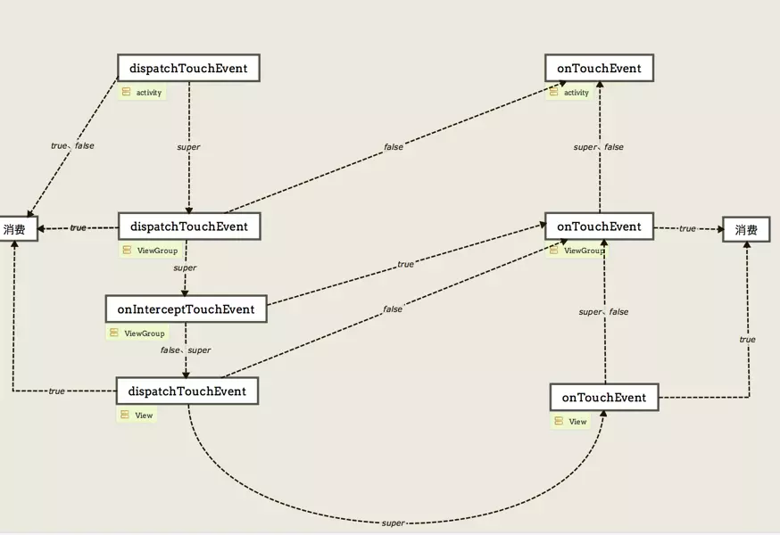

# **View的基础知识**

## MotionEvent和TouchSlop
1. MotionEvent
 - Action_DOWN 手指刚接触屏幕
 - ACTION_MOVE 手机在屏幕上滑动
 - ACTION_UP 手指从屏幕上松开的一瞬间

通过MotionEvent对象可以得到点击事件的x和y坐标  
getX()/getY() 相对于当前View左上角的坐标  
getRawX()/getRawY() 相对于屏幕左上角的坐标

2. TouchSlop
 TouchSlop 是系统所能识别出的被认为是滑动的最小距离,处理滑动时可以利用这个常量来做一些过滤.
 /frameworks/base/core/res/res/values/config.xml  
 `
<dimen name="config_viewConfigurationTouchSlop">8dp</dimen>
`

## VelocityTracker、GestureDetector和Scroller

VelocityTracker: 用于跟踪手指在滑动过程中的速度，包括水平和垂直方向上的速度  
GestureDetector: 手势检测，用于辅助检测用户的单击、滑动、长按、双击等行为  
Scroller:弹性滑动对象，实现View的弹性滑动。

# View的滑动

## 1.使用scrollTo/scrollBy

``` java

    /**
     * Set the scrolled position of your view. This will cause a call to
     * {@link #onScrollChanged(int, int, int, int)} and the view will be
     * invalidated.
     * @param x the x position to scroll to
     * @param y the y position to scroll to
     */
    public void scrollTo(int x, int y) {
        if (mScrollX != x || mScrollY != y) {
            int oldX = mScrollX;
            int oldY = mScrollY;
            mScrollX = x;
            mScrollY = y;
            invalidateParentCaches();
            onScrollChanged(mScrollX, mScrollY, oldX, oldY);
            if (!awakenScrollBars()) {
                postInvalidateOnAnimation();
            }
        }
    }

    public void scrollBy(int x, int y) {
        scrollTo(mScrollX + x, mScrollY + y);
    }
```

使用scrollTo()和scrollBy()实现View的滑动只能将View的内容进行移动，并不能将View本身移动.

``` java
 /**
     * The offset, in pixels, by which the content of this view is scrolled
     * horizontally.
     * {@hide}
     */
    protected int mScrollX;
    /**
     * The offset, in pixels, by which the content of this view is scrolled
     * vertically.
     * {@hide}
     */
    protected int mScrollY;
```    

## 2.使用动画
可以使用属性动画完成View的移动
``` java
ObjectAnimator.ofFloat(targetView, "translationX", 0 300).setDuration(1000).start();
```
## 3.改变布局参数
通过改变View的LayoutParams即可改变View的位置

# View的事件分发机制

事件分发其实就是对于MotionEvent对象的传递过程。
``` java
public boolean dispatchTouchEvent(MotionEvent ev){
    boolean consume = false;
    if(onInterceptTouchEvent(ev)){
        consume = onTouchEvent(ev);
    }else{
        consume = child.dispatchTouchEvent() //交给子元素去处理
    }
    return consume;
}

```



# **View的滑动冲突**

## 常见的滑动冲突场景
 场景一: 外部滑动方向和内部滑动方向不一致 (ViewPager嵌套RecyclerView)  
 场景二: 外部滑动方向和内部滑动方向一致 (RecyclerView嵌套RecyclerView)  
 场景三: 上面两种情况的结合


## 滑动冲突的处理规则
场景一: 根据手指滑动方向来判断，当左右滑动时让外部View拦截点击事件，当上下滑动时让内部View拦截点击事件。根据特征来解决滑动冲突。判断滑动方向可以通过滑动路径和水平方向的夹角、水平方向和竖直方向的距离差、水平方向和竖直方向的速度差。  
场景二: 无法根据滑动的方向来判断，根据业务规则来进行处理。  
场景三: 根据业务规则找到突破点。

## 滑动冲突的解决方式

- 外部拦截法 点击事件先经过父容器的拦截处理，父容器需要拦截此事件就拦截不需要拦截此事件就交由子View处理事件。

``` java
public boolean onInterceptTouchEvent(MotionEvent event){
    //是否拦截此事件
    boolean intercepted = false;
    int x = (int)event.getX();
    int y = (int)event.getY();
    switch(event.getAction()){
        case MotionEvent.ACTION_DOWN:
            intercepted = false;
            break;
        case MotionEvent.ACTION_MOVE:
            if(父容器需要拦截此事件){
                intercepted = true;
            }else{
                intercepted = false;
            } 
            break;
        case MotionEvent.ACTION_UP:
            intercepted = false;
            break;
        default: 
            break;

    }
    return intercepted;
}
```
在上面代码中，ACTION_DOWN事件必须返回false，即不拦截此事件

ViewPager中处理滑动冲突就是采用的此方法。
``` java
@Override
    public boolean onInterceptTouchEvent(MotionEvent ev) {
        /*
         * This method JUST determines whether we want to intercept the motion.
         * If we return true, onMotionEvent will be called and we do the actual
         * scrolling there.
         */

        final int action = ev.getAction() & MotionEventCompat.ACTION_MASK;

        // Always take care of the touch gesture being complete.
        if (action == MotionEvent.ACTION_CANCEL || action == MotionEvent.ACTION_UP) {
            // Release the drag.
            if (DEBUG) Log.v(TAG, "Intercept done!");
            resetTouch();
            return false;
        }

        // Nothing more to do here if we have decided whether or not we
        // are dragging.
        if (action != MotionEvent.ACTION_DOWN) {
            if (mIsBeingDragged) {
                if (DEBUG) Log.v(TAG, "Intercept returning true!");
                return true;
            }
            if (mIsUnableToDrag) {
                if (DEBUG) Log.v(TAG, "Intercept returning false!");
                return false;
            }
        }

        switch (action) {
            case MotionEvent.ACTION_MOVE: {
                /*
                 * mIsBeingDragged == false, otherwise the shortcut would have caught it. Check
                 * whether the user has moved far enough from his original down touch.
                 */

                /*
                * Locally do absolute value. mLastMotionY is set to the y value
                * of the down event.
                */
                final int activePointerId = mActivePointerId;
                if (activePointerId == INVALID_POINTER) {
                    // If we don't have a valid id, the touch down wasn't on content.
                    break;
                }

                final int pointerIndex = MotionEventCompat.findPointerIndex(ev, activePointerId);
                final float x = MotionEventCompat.getX(ev, pointerIndex);
                final float dx = x - mLastMotionX;
                final float xDiff = Math.abs(dx);
                final float y = MotionEventCompat.getY(ev, pointerIndex);
                final float yDiff = Math.abs(y - mInitialMotionY);
                if (DEBUG) Log.v(TAG, "Moved x to " + x + "," + y + " diff=" + xDiff + "," + yDiff);

                if (dx != 0 && !isGutterDrag(mLastMotionX, dx) &&
                        canScroll(this, false, (int) dx, (int) x, (int) y)) {
                    // Nested view has scrollable area under this point. Let it be handled there.
                    mLastMotionX = x;
                    mLastMotionY = y;
                    mIsUnableToDrag = true;
                    return false;
                }
                if (xDiff > mTouchSlop && xDiff * 0.5f > yDiff) {
                    if (DEBUG) Log.v(TAG, "Starting drag!");
                    mIsBeingDragged = true;
                    requestParentDisallowInterceptTouchEvent(true);
                    setScrollState(SCROLL_STATE_DRAGGING);
                    mLastMotionX = dx > 0 ? mInitialMotionX + mTouchSlop :
                            mInitialMotionX - mTouchSlop;
                    mLastMotionY = y;
                    setScrollingCacheEnabled(true);
                } else if (yDiff > mTouchSlop) {
                    // The finger has moved enough in the vertical
                    // direction to be counted as a drag...  abort
                    // any attempt to drag horizontally, to work correctly
                    // with children that have scrolling containers.
                    if (DEBUG) Log.v(TAG, "Starting unable to drag!");
                    mIsUnableToDrag = true;
                }
                if (mIsBeingDragged) {
                    // Scroll to follow the motion event
                    if (performDrag(x)) {
                        ViewCompat.postInvalidateOnAnimation(this);
                    }
                }
                break;
            }

            case MotionEvent.ACTION_DOWN: {
                /*
                 * Remember location of down touch.
                 * ACTION_DOWN always refers to pointer index 0.
                 */
                mLastMotionX = mInitialMotionX = ev.getX();
                mLastMotionY = mInitialMotionY = ev.getY();
                mActivePointerId = MotionEventCompat.getPointerId(ev, 0);
                mIsUnableToDrag = false;

                mScroller.computeScrollOffset();
                if (mScrollState == SCROLL_STATE_SETTLING &&
                        Math.abs(mScroller.getFinalX() - mScroller.getCurrX()) > mCloseEnough) {
                    // Let the user 'catch' the pager as it animates.
                    mScroller.abortAnimation();
                    mPopulatePending = false;
                    populate();
                    mIsBeingDragged = true;
                    requestParentDisallowInterceptTouchEvent(true);
                    setScrollState(SCROLL_STATE_DRAGGING);
                } else {
                    completeScroll(false);
                    mIsBeingDragged = false;
                }

                if (DEBUG) Log.v(TAG, "Down at " + mLastMotionX + "," + mLastMotionY
                        + " mIsBeingDragged=" + mIsBeingDragged
                        + "mIsUnableToDrag=" + mIsUnableToDrag);
                break;
            }

            case MotionEventCompat.ACTION_POINTER_UP:
                onSecondaryPointerUp(ev);
                break;
        }

        if (mVelocityTracker == null) {
            mVelocityTracker = VelocityTracker.obtain();
        }
        mVelocityTracker.addMovement(ev);

        /*
         * The only time we want to intercept motion events is if we are in the
         * drag mode.
         */
        return mIsBeingDragged;
    }
```
- 内部拦截法，内部拦截法是指父容器不拦截任何事件，所有的点击事件交于子View来处理，如果子元素需要处理则消耗掉该事件，否则交由父容器去处理

``` java
public boolean dispatchTouchEvent(MotionEvent event){
    int x = (int)event.getX();
    int y = (int)event.getY();
    switch(event.getAction()){
        case MotionEvent.ACTION_DOWN:
            parent.requestDisallowInterceptTouchEvent(true);
            break;
        case MotionEvent.ACTION_MOVE:
            if(子View需要处理此事件){
                parent.requestDisallowInterceptTouchEvent(false);
            }
            break;
        case MotionEvent.ACTION_UP:
            break;
        default:
            break;
    }
    return super.dispatchTouchEvent(event);
}
```
