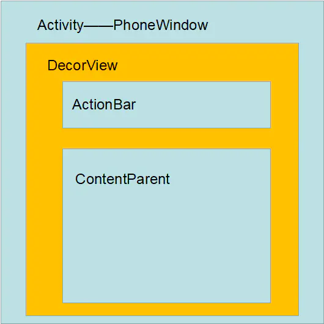

# **View的工作原理**

## 初识ViewRoot和DecorView
&ensp;&ensp;ViewRoot对应于的是ViewRootImpl类，它是连接WindowManager和DecorView的纽带。在ActivityThread中当Activity对象被创建完毕后，会将DecorView添加到Window中,同时创建ViewRootImpl对象，并且将ViewRootImpl对象和DecorView建立关联。
``` java
/**
 * ViewRootImpl
 * The top of a view hierarchy, implementing the needed protocol between View
 * and the WindowManager.  This is for the most part an internal implementation
 * detail of {@link WindowManagerGlobal}.
 *
 */
```

&ensp;&ensp;View的绘制流程是从ViewRootImpl的performTraversals方法开始的，其中measure用来测量View的宽和高，layout用来确定View的位置，draw用来负责将View绘制在屏幕上。

&ensp;&ensp;DecorView作为顶级的View,一般情况下它内部会包含一个竖直方向的LinearLayout,在这个LinearLayout中有上下两部分，上面是标题栏下面是内容栏。在Activity中的onCreate()方法中通过setContentView()方法设置的layout的id就是设置内容栏的布局。


## 理解MeasureSpec

&ensp;&ensp;MeaureSpec代表一个32位的int值，高2位代表的是SpecMode,低30位代表的是SpecSize,SpecMode代表的是测量模式，SpecSize代表的是某种测量模式下的规格大小。SpecMode有三类在下面代码注释中有说明。
```java
        private static final int MODE_SHIFT = 30;
        private static final int MODE_MASK  = 0x3 << MODE_SHIFT;

        /**
         * Measure specification mode: The parent has not imposed any constraint
         * on the child. It can be whatever size it wants.
         */
        public static final int UNSPECIFIED = 0 << MODE_SHIFT;

        /**
         * Measure specification mode: The parent has determined an exact size
         * for the child. The child is going to be given those bounds regardless
         * of how big it wants to be.对应于LayoutParams中的match_parent和具体的数值
         */
        public static final int EXACTLY     = 1 << MODE_SHIFT;

        /**
         * Measure specification mode: The child can be as large as it wants up
         * to the specified size. 对应于LayoutParams中的wrap_content
         */
        public static final int AT_MOST     = 2 << MODE_SHIFT;
```

&ensp;&ensp;在View进行测量的时候，系统会将LayoutParams在父容器的约束下转换成对应的MeasureSpec，然后再根据这个MeasureSpec来确定View测量后的宽/高。MeasureSpec不是唯一由LayoutParams决定的，LayoutParams需要和父容器一起才决定View的MeasureSpec，从而决定View的宽/高。  
- 对于顶级View(DecorView)，其MeasureSpec由窗口的尺寸和其自身的LayoutParams来共同确定
- 对于普通View，其MeasureSpec由父容器的MeasureSpec和其自身的LayoutParams来确定

对于顶级View的情况: ViewRootImpl中的measureHierarchy()方法中显示了DecorView的MeasureSpec的创建过程。
```java
    childWidthMeasureSpec = getRootMeasureSpec(baseSize, lp.width);
    childHeightMeasureSpec = getRootMeasureSpec(desiredWindowHeight, lp.height);
    performMeasure(childWidthMeasureSpec, childHeightMeasureSpec);
```
getRootMeasureSpec()方法实现如下
```java
private static int getRootMeasureSpec(int windowSize, int rootDimension) {
        int measureSpec;
        switch (rootDimension) {

        case ViewGroup.LayoutParams.MATCH_PARENT:
            // Window can't resize. Force root view to be windowSize.
            measureSpec = MeasureSpec.makeMeasureSpec(windowSize, MeasureSpec.EXACTLY);
            break;
        case ViewGroup.LayoutParams.WRAP_CONTENT:
            // Window can resize. Set max size for root view.
            measureSpec = MeasureSpec.makeMeasureSpec(windowSize, MeasureSpec.AT_MOST);
            break;
        default:
            // Window wants to be an exact size. Force root view to be that size.
            measureSpec = MeasureSpec.makeMeasureSpec(rootDimension, MeasureSpec.EXACTLY);
            break;
        }
        return measureSpec;
    }
```

对于普通的View的来说，View的measure过程由ViewGroup传递过来
``` java
    protected void measureChildWithMargins(View child,
            int parentWidthMeasureSpec, int widthUsed,
            int parentHeightMeasureSpec, int heightUsed) {
        final MarginLayoutParams lp = (MarginLayoutParams) child.getLayoutParams();

        final int childWidthMeasureSpec = getChildMeasureSpec(parentWidthMeasureSpec,
                mPaddingLeft + mPaddingRight + lp.leftMargin + lp.rightMargin
                        + widthUsed, lp.width);
        final int childHeightMeasureSpec = getChildMeasureSpec(parentHeightMeasureSpec,
                mPaddingTop + mPaddingBottom + lp.topMargin + lp.bottomMargin
                        + heightUsed, lp.height);

        child.measure(childWidthMeasureSpec, childHeightMeasureSpec);
    }

```

从代码可以看出来子View的MeasureSpec的创建与父容器的MeasureSpec和其自身的LayoutParams有关。此外还与View的margin及padding有关。

```java 
 public static int getChildMeasureSpec(int spec, int padding, int childDimension) {
        int specMode = MeasureSpec.getMode(spec);
        int specSize = MeasureSpec.getSize(spec);

        int size = Math.max(0, specSize - padding);

        int resultSize = 0;
        int resultMode = 0;

        switch (specMode) {
        // Parent has imposed an exact size on us
        case MeasureSpec.EXACTLY:
            if (childDimension >= 0) {
                resultSize = childDimension;
                resultMode = MeasureSpec.EXACTLY;
            } else if (childDimension == LayoutParams.MATCH_PARENT) {
                // Child wants to be our size. So be it.
                resultSize = size;
                resultMode = MeasureSpec.EXACTLY;
            } else if (childDimension == LayoutParams.WRAP_CONTENT) {
                // Child wants to determine its own size. It can't be
                // bigger than us.
                resultSize = size;
                resultMode = MeasureSpec.AT_MOST;
            }
            break;

        // Parent has imposed a maximum size on us
        case MeasureSpec.AT_MOST:
            if (childDimension >= 0) {
                // Child wants a specific size... so be it
                resultSize = childDimension;
                resultMode = MeasureSpec.EXACTLY;
            } else if (childDimension == LayoutParams.MATCH_PARENT) {
                // Child wants to be our size, but our size is not fixed.
                // Constrain child to not be bigger than us.
                resultSize = size;
                resultMode = MeasureSpec.AT_MOST;
            } else if (childDimension == LayoutParams.WRAP_CONTENT) {
                // Child wants to determine its own size. It can't be
                // bigger than us.
                resultSize = size;
                resultMode = MeasureSpec.AT_MOST;
            }
            break;

        // Parent asked to see how big we want to be
        case MeasureSpec.UNSPECIFIED:
            if (childDimension >= 0) {
                // Child wants a specific size... let him have it
                resultSize = childDimension;
                resultMode = MeasureSpec.EXACTLY;
            } else if (childDimension == LayoutParams.MATCH_PARENT) {
                // Child wants to be our size... find out how big it should
                // be
                resultSize = View.sUseZeroUnspecifiedMeasureSpec ? 0 : size;
                resultMode = MeasureSpec.UNSPECIFIED;
            } else if (childDimension == LayoutParams.WRAP_CONTENT) {
                // Child wants to determine its own size.... find out how
                // big it should be
                resultSize = View.sUseZeroUnspecifiedMeasureSpec ? 0 : size;
                resultMode = MeasureSpec.UNSPECIFIED;
            }
            break;
        }
        return MeasureSpec.makeMeasureSpec(resultSize, resultMode);
    }

```

