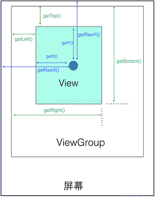
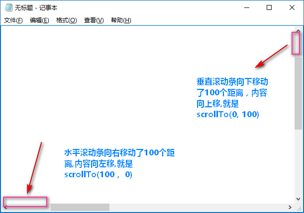

# View体系与自定义View

## 3.1 View与ViewGroup
View是Android所有控件的基类，常用的TextView、ImageView等等都是继承自View。  
常用的布局控件比如LinearLayout、RelativeLayout是继承自ViewGroup。  
ViewGroup同样也是继承自View
## 3.2 坐标系
Android系统中有两种坐标系，Android坐标系和View坐标系。
### 3.2.1 Android坐标系
在Android中，将屏幕左上角的顶点作为Android坐标系的原点，这个原点向右是X轴正方向，向下是Y轴正方向。MotionEvent中getRawX()、getRawY()获取的就是Android坐标系的坐标。
### 3.2.2 View坐标系
|  View的静态方法   | 解释  |
|  ----  | ----  |
| getLeft()  | 返回View自身左边到父布局左边的距离 |
| getTop()  | 返回View自身顶边到父布局顶边的距离 |
| getRight()  | 返回View自身右边到父布局右边的距离 |
| getBottom()  | 返回View自身右边到父布局底边的距离 |
| getX()、getY()  | View左上角相对于父容器的坐标 |  

当View没有发生平移操作时，getX()==getLeft()、getY==getTop()  
|  MotionEvent的静态方法   | 解释  |
|  ----  | ----  |
| getX()  | 获取点击事件距离控件左边的距离，即视图坐标 |
| getY()  | 获取点击事件距离控件顶边的距离，即视图坐标 |
| getRawX()  | 获取点击事件距离整个屏幕左边的距离，即绝对坐标 |
| getRawY()  | 获取点击事件距离整个屏幕顶边的距离，即绝对坐标 |
下图中的蓝色箭头表示对应于MotionEvent的事件的坐标  



## 3.3 View的滑动
### 3.3.1 layout()方法
View在进行绘制时会调用onLayout()方法来设置显示的位置，因此可以通过修改View的left、top、right、bottom这四种属性来控制View的坐标。在自定义View中，通过重写onTouchEvent()方法来实现。  
```java
public boolean onTouchEvent(MotionEvent event){
    int x = (int)event.getX();
    int y = (int)event.getY();

    switch(event.getAction){
        case MotionEvent.ACTION_DOWN:
            lastX = x;
            lasyY = y;
            break;
        case MotionEvent.ACTION_MOVE:
            int offsetX = x - lastX;
            int offsetY = y - lastY;
            layout(getLeft() + offsetX, getTop() + offsetY, getRight() + offsetX, getBottom() + offsetY);
            break;           
    }
    return true;
}

```
### 3.3.2 offsetLeftAndRight()与offsetTopAndBottom()方法
```java
public boolean onTouchEvent(MotionEvent event){
    int x = (int)event.getX();
    int y = (int)event.getY();

    switch(event.getAction){
        case MotionEvent.ACTION_DOWN:
            lastX = x;
            lasyY = y;
            break;
        case MotionEvent.ACTION_MOVE:
            int offsetX = x - lastX;
            int offsetY = y - lastY;
            // 移动View
            offsetLeftAndRight(offsetX);
            offsetTopAndBottom(offsetY);
            break;           
    }
    return true;
}
```

### 3.3.3 改变LayoutParams
可以通过改变View的参数来达到改变View位置的效果。

```java
public boolean onTouchEvent(MotionEvent event){
    int x = (int)event.getX();
    int y = (int)event.getY();

    switch(event.getAction){
        case MotionEvent.ACTION_DOWN:
            lastX = x;
            lasyY = y;
            break;
        case MotionEvent.ACTION_MOVE:
            int offsetX = x - lastX;
            int offsetY = y - lastY;
            // 移动View
            LinearLayout.LayoutParams layoutParams = (LinearLayout.LayoutParams) getLayoutParams();
            layoutParams.leftMargin +=  (int)dismenX;
            layoutParams.topMargin += (int)dismenY;
            setLayoutParams(layoutParams);
            break;           
    }
    return true;
}
```
### 3.3.4 动画
View动画并不能改变View的位置参数，属性动画可以做到，属性动画可以改变View的位置参数。
```java
ObjectAnimator.ofFloat(view, "translationX", 0, 300).setDuration(1000).start();
```
### 3.3.5 scrollTo和scrollBy
scrollTo(x, y)表示移动到一个具体的坐标点，而scrollBy(dx, dy)表示移动的增量，其中scrollBy()最终也要调用scrollTo()方法。  
**scrollTo和scrollBy方法移动的是View的内容，并不能移动View本身**  

scrollTo()方法本身滚动的是View的内容，View本身位置不变。可以将该View想象成一个带滚动条的窗体，我们以滚动条作为参照物：

1. 当水平滚动条向右移动时，原本窗体显示的内容向左移动，比方说水平滚动条向右移动了100的距离，同样的窗体显示的内容就向左移动了100的距离，这个时候也就是scrollTo(100, 0)；

2. 当滚动条向下移动时，原本窗体显示的内容应向上移动，比方说垂直滚动条向下移动了100的距离，同样的窗体显示的内容就向上移动了100的距离，这个时候也就是scrollTo(0, 100);

这也就解释了为什么scrollTo()方法中参数大于0，View向左移动，参数小于0，View向右移动。


### 3.3.6 Scroller
使用scrollTo和scrollBy方法进行滑动时，这个过程是瞬间完成的，可以使用Scroller来完成过渡滑动的效果。
典型使用方法如下 重写View的computeScroll方法然后使用Scroller对象进行滑动。 
```java
    public void smoothScrollerTo(int destX, int destY){
        int scrollX = getScrollX();
        int scrollY = getScrollY();
        int deltaX = destX - scrollX;
        int deltay = destY - scrollY;
        mScroller.startScroll(scrollX, scrollY, deltaX, deltay,20000);
        invalidate();
    }

    @Override
    public void computeScroll() {
        super.computeScroll();
        if(mScroller.computeScrollOffset()){
            scrollTo(mScroller.getCurrX(), mScroller.getCurrY());
            invalidate();
        }
    }
```

## 3.4 属性动画

Android提供的动画有View动画、帧动画和属性动画。View动画提供了四种动画方式分别是AlphaAnimation、RotateAnimation、TranslateAnimation和ScaleAnimation。View动画一个很大的缺陷就是它不具备交互性，当某个元素执行View动画后，其相应事件仍然在动画执行前的地方。  
1. ObjectAnimator  
ObjectAnimator继承自ValueAnimator，常见使用方法如下。ObjectAnimator类针对的是任意对象&任意属性值。
```java
    ObjectAnimator translationAnim = ObjectAnimator.ofFloat(view, "translationX", 200);
    translationAnim.setDuration(3000);
    translationAnim.start();
```
2. ValueAnimator  
ValueAnimator不提供任何动画效果，它是一个数值发生器，用来产生有规律的数字，从而让调用者控制动画的实现过程。
3. 动画监听器 AnimatorListener
4. 组合动画 AnimatorSet
5. 组合动画 PropertyValuesHolder

## 3.5 解析Scroller


